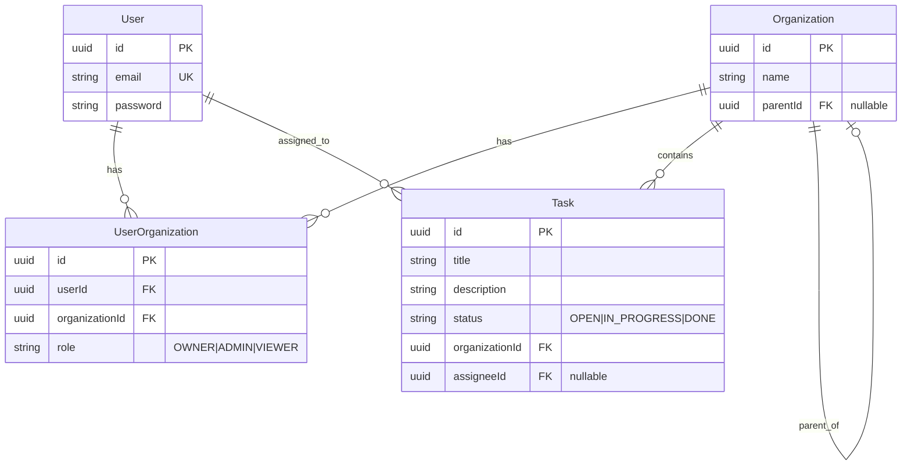

# Task Manager - Secure Task Management System

A full-stack task management application with role-based access control (RBAC), built with NestJS backend, Angular frontend, and PostgreSQL database.

## Demo


## Setup Instructions

### Prerequisites
- Docker and Docker Compose
- Node.js 18+ (for local development)

### Running with Docker

Start both backend and frontend simultaneously:

```bash
docker compose up
```

- **Backend API**: http://localhost:8080/api
- **Frontend Dashboard**: http://localhost:4200
- **PostgreSQL**: localhost:5432

### Environment Variables

Create a `.env` file in the root directory (or set in `docker-compose.yml`):

```env
JWT_SECRET=your-secret-key-here
POSTGRES_USER=user
POSTGRES_PASSWORD=password
POSTGRES_DB=taskdb
DB_HOST=postgres
DB_PORT=5432
PORT=8080
```

**Note**: For production, use strong, randomly generated secrets and secure database credentials.

### Local Development (Without Docker)

```bash
# Install dependencies
yarn install

# Start backend
npx nx serve api

# Start frontend (in another terminal)
npx nx serve dashboard
```

## Architecture Overview

### NX Monorepo Structure

```
task-manager/
├── apps/
│   ├── api/              # NestJS backend application
│   └── dashboard/        # Angular frontend application
└── libs/
    ├── data/             # Shared TypeScript interfaces & DTOs
    └── auth/             # Reusable RBAC logic and decorators
```

**Rationale**: The NX monorepo enables:
- **Code sharing**: Type-safe interfaces and DTOs between frontend and backend
- **Consistent types**: Single source of truth for data models
- **Reusable logic**: Auth decorators and guards shared across modules
- **Atomic changes**: Update API and frontend together in one commit

### Shared Libraries

#### `@task-manager/data`
- **Purpose**: Shared TypeScript interfaces and enums
- **Exports**: `User`, `Task`, `Organization`, `Role` enum, `AuthResponse`
- **Usage**: Imported by both frontend and backend for type safety

#### `@task-manager/auth`
- **Purpose**: Reusable authentication and authorization utilities
- **Exports**: 
  - `@CurrentUser()` decorator (extracts user from JWT)
  - `@Roles()` decorator (specifies required roles)
  - `RolesGuard` (enforces role-based access)
- **Usage**: Applied to controllers and routes for RBAC

## Data Model Explanation

### Overview

The database schema implements a multi-tenant task management system with hierarchical organizations and role-based access control. The design supports:

- **Multi-organization membership**: Users can belong to multiple organizations with different roles in each
- **Hierarchical organizations**: Organizations can have parent-child relationships (2-level hierarchy)
- **Task ownership**: Tasks belong to organizations and can be assigned to users
- **Role-based permissions**: Three roles (OWNER, ADMIN, VIEWER) with different permission levels per organization

### Entity Relationship Diagram (ERD)



### Schema Description

#### User Table
- **Purpose**: Stores user account information
- **Primary Key**: `id` (UUID)
- **Unique Constraints**: `email`
- **Relationships**:
  - One-to-many with `UserOrganization` (memberships in organizations)
  - One-to-many with `Task` (as assignee)

#### Organization Table
- **Purpose**: Represents organizational units that own tasks
- **Primary Key**: `id` (UUID)
- **Features**:
  - Supports hierarchical structure via `parentId` (2-level hierarchy)
  - Self-referential relationship for parent-child organizations
- **Relationships**:
  - One-to-many with `UserOrganization` (members)
  - One-to-many with `Task` (owned tasks)
  - Self-referential (parent-child)

#### UserOrganization Table (Join Table)
- **Purpose**: Many-to-many relationship between Users and Organizations with role information
- **Primary Key**: `id` (UUID)
- **Unique Constraints**: Composite unique constraint on `(userId, organizationId)`
- **Role Field**: Stores one of three values:
  - `OWNER`: Full control (create, read, update, delete tasks; manage members)
  - `ADMIN`: Management access (create, read, update, delete tasks; manage members)
  - `VIEWER`: Read-only access (view tasks only)
- **Relationships**:
  - Many-to-one with `User`
  - Many-to-one with `Organization`

#### Task Table
- **Purpose**: Stores task information
- **Primary Key**: `id` (UUID)
- **Status Field**: One of `OPEN`, `IN_PROGRESS`, `DONE`
- **Relationships**:
  - Many-to-one with `Organization` (required - tasks must belong to an organization)
  - Many-to-one with `User` (optional - tasks can be assigned to a user)

## Access Control Implementation

### Role-Based Permissions

The system implements three roles with hierarchical permissions:

| Role | Task Operations | Organization Management |
|------|----------------|------------------------|
| **OWNER** | Create, Read, Update, Delete | Full control (rename org, manage members) |
| **ADMIN** | Create, Read, Update, Delete | Full control (rename org, manage members) |
| **VIEWER** | Read only | None |

### Permission Enforcement

1. **Task-Level Access**: Permissions are checked per-task based on the user's role in that task's organization
2. **Organization Isolation**: Users can only access tasks from organizations they belong to
3. **Cross-Organization Access**: Users cannot view/edit tasks from organizations they're not members of

### JWT Authentication Integration

**Token Structure**:
```json
{
  "sub": "user-id",
  "username": "user@example.com",
  "role": "OWNER",
  "orgId": "organization-id"
}
```

**Authentication Flow**:
1. User logs in with email/password → `POST /api/auth/login`
2. Backend validates credentials and generates JWT with user ID, role, and organization ID
3. Frontend stores token in localStorage
4. All subsequent requests include token in `Authorization: Bearer <token>` header
5. `JwtAuthGuard` validates token and extracts user information
6. `RolesGuard` checks user's role against route requirements

**Authorization Flow**:
1. `@CurrentUser()` decorator extracts user from validated JWT
2. Service layer queries `UserOrganization` table to get user's role in specific organization
3. Permission checks are performed at the service level:
   - Task operations verify user's role in the task's organization
   - Organization operations verify user's role in the target organization
4. `ForbiddenException` is thrown if user lacks required permissions

**Key Implementation Details**:
- Roles are **organization-scoped**: A user can be OWNER in Org A and VIEWER in Org B
- Permissions are checked **per-operation**: Each task update/delete verifies the user's role in that task's organization
- JWT contains initial role/org, but service layer always re-queries for current permissions

## API Documentation

All endpoints are prefixed with `/api`. Authentication required for all endpoints except `/api/auth/*`.

### Authentication Endpoints

#### `POST /api/auth/email-exists`
Check if an email is already registered.

**Request**:
```json
{
  "email": "user@example.com"
}
```

**Response**:
```json
{
  "message": "Account exists",
  "exists": true
}
```

#### `POST /api/auth/login`
Authenticate user and receive JWT token.

**Request**:
```json
{
  "email": "user@example.com",
  "password": "password123"
}
```

**Response**:
```json
{
  "access_token": "eyJhbGciOiJIUzI1NiIsInR5cCI6IkpXVCJ9...",
  "user": {
    "id": "uuid",
    "email": "user@example.com"
  }
}
```

#### `POST /api/auth/register`
Register a new user account.

**Request**:
```json
{
  "email": "user@example.com",
  "password": "password123"
}
```

**Response**:
```json
{
  "message": "Sign up successful! Check your email for a verification link!",
  "user": {
    "id": "uuid",
    "email": "user@example.com"
  }
}
```

#### `GET /api/auth/me`
Get current authenticated user information.

**Headers**: `Authorization: Bearer <token>`

**Response**:
```json
{
  "id": "uuid",
  "email": "user@example.com"
}
```

### Task Endpoints

#### `GET /api/tasks`
Get all tasks from organizations the user has access to.

**Headers**: `Authorization: Bearer <token>`

**Response**:
```json
[
  {
    "id": "uuid",
    "title": "Task Title",
    "description": "Task description",
    "status": "OPEN",
    "organizationId": "uuid",
    "assigneeId": null,
    "assignee": null,
    "organization": {
      "id": "uuid",
      "name": "Organization Name"
    }
  }
]
```

#### `POST /api/tasks`
Create a new task. Requires OWNER or ADMIN role.

**Headers**: `Authorization: Bearer <token>`

**Request**:
```json
{
  "title": "New Task",
  "description": "Task description",
  "status": "OPEN",
  "organizationId": "uuid"
}
```

**Response**: Created task object

#### `GET /api/tasks/:id`
Get a specific task by ID.

**Headers**: `Authorization: Bearer <token>`

**Response**: Task object

#### `PATCH /api/tasks/:id`
Update a task. Requires OWNER or ADMIN role in task's organization.

**Headers**: `Authorization: Bearer <token>`

**Request**:
```json
{
  "title": "Updated Title",
  "status": "IN_PROGRESS"
}
```

**Response**: Updated task object

#### `DELETE /api/tasks/:id`
Delete a task. Requires OWNER or ADMIN role in task's organization.

**Headers**: `Authorization: Bearer <token>`

**Response**: 200 OK

### Organization Endpoints

#### `GET /api/organizations`
Get all organizations the user has access to.

**Headers**: `Authorization: Bearer <token>`

**Response**:
```json
[
  {
    "id": "uuid",
    "name": "Organization Name",
    "roles": {
      "user-id-1": "OWNER",
      "user-id-2": "ADMIN"
    }
  }
]
```

#### `POST /api/organizations`
Create a new organization. User becomes OWNER.

**Headers**: `Authorization: Bearer <token>`

**Request**:
```json
{
  "name": "New Organization"
}
```

**Response**: Created organization with roles

#### `PATCH /api/organizations/:id`
Update organization name. Requires OWNER or ADMIN role.

**Headers**: `Authorization: Bearer <token>`

**Request**:
```json
{
  "name": "Updated Name"
}
```

**Response**: Updated organization with roles

#### `GET /api/organizations/:id/members`
Get all members of an organization.

**Headers**: `Authorization: Bearer <token>`

**Response**:
```json
[
  {
    "userId": "uuid",
    "email": "user@example.com",
    "role": "OWNER"
  }
]
```

#### `POST /api/organizations/:id/members`
Add a member to an organization. Requires OWNER or ADMIN role.

**Headers**: `Authorization: Bearer <token>`

**Request**:
```json
{
  "email": "newmember@example.com",
  "role": "VIEWER"
}
```

**Response**: Updated members list

#### `PATCH /api/organizations/:id/members/:userId/role`
Update a member's role. Requires OWNER or ADMIN role. Cannot change own role.

**Headers**: `Authorization: Bearer <token>`

**Request**:
```json
{
  "role": "ADMIN"
}
```

**Response**: Updated members list

#### `PATCH /api/organizations/:id/members/:userId/remove`
Remove a member from an organization. Requires OWNER or ADMIN role. Cannot remove self.

**Headers**: `Authorization: Bearer <token>`

**Response**: Updated members list
